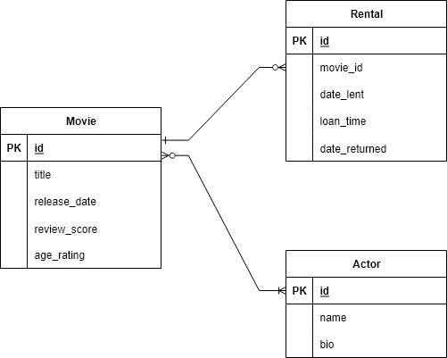

# AWD CA1 'Laravel Movies'

This is an implementation of the CRUD pattern in Laravel based on a
film rentals model. It contains a complete Model-View-Controller setup
as well as an authentication system provided by Laravel.

I have also added the ability to search movies by title or description
keywords through implementing the Laravel Scout package.

## Weekly Progress Overview

### Week 1

During my first week I was introduced to Laravel and the idea of
Model-View-Controllers. The MVC pattern was established by the
developers of Smalltalk, an object-oriented programming language,
in 1979. At a high level, it describes three different structures:

 - A Model, which holds data for a certain object.
 - A View, capable of rendering and presenting the object.
 - A Controller, a set of functions to modify the object.

This pattern has been adopted in the past ten years by various web
frameworks as a way of establishing a regular pattern for the
presentation and interactivity of websites, and their communication
with backend databases.

With all this in mind, we installed Laravel and created new projects
using its default template. We then modified the Blade template for
the landing page as a way of getting familiar with Laravel's
HTML templating system.

### Week 2

The second week was spent getting up to speed on the creation of models
and their surrounding logic. In the labs, we created a model for different
species of plants and displayed a list of them all using HTML Blade templates.

We also started our projects this week. I chose to create an app for
movie rentals in the vein of old DVD rental shops. I chose this
because it presents a unique opportunity for database interactions
regarding the tracking of rentals and inventory availability which
I can choose to implement later.

Before creating any models, I designed an ERD diagram of how each
object should interact with each other:

What this means is that the central model in my Laravel application
is the Movie. Users can sign up, search Movies, and in the future,
rent specific copies of the Movie.

I also created migrations and database seeders for my new model.
A migration is a reversable set of operations done to a database
to update it from one schema to another. In my case, I create
the database table for my Movie model. Then, database seeders can
be ran afterwards to initialise the database to a certain state.
My `MovieSeeder` class inserts a selection of sample movies.

### Week 3

This week was spent creating CRUD methods and pages for our models.
CRUD stands for Create, Read, Update and Delete, and forms the basis
of most websites' user interactions.

We all created a 'show all' page as well as a page for individual items,
but we were also encouraged to go a bit further and implement something
of our own. I decided to implement search functionality using Laravel Scout.

Laravel Scout is a plugin for Laravel which lets you easily set up
search indexing and keyword searches for any model which you
`use Searchable` on. You do not need to set up additional
database tables because Laravel Scout can operate purely using
PHP collections to aid quick prototyping.

Finally, I added a search bar component and extra methods to
my Movie model to interact with Laravel Scout when provided with
search keywords. The search bar slots into the navbar at the top
of any page and lets you easily find whatever movie anywhere you
are on the website.

### Week 4

Week 4 was spent doing cleanup and documentation of the codebase, in
preparation for submitting CA1.

In the future, additional features could be implemented,
like a new theme, or a star rating system.
